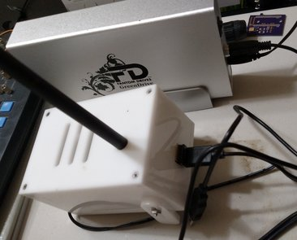

# CC1101-Weather-Receiver

The CC1101 Weather Receiver (CCWXRX) receives transmissions from Davis Instruments wireless weather devices. It can receive data from up to eight Davis devices, the maximum number possible with their protocol.  The receiver is known to work with the Vantage Pro2 ISS and Leaf and Soil Moisture/Temperature Station, and should work with the Vantage Vue as well. It can receive transmissions from repeaters as well. Processing and archiving of weather data does not occur onboard the device. The packets are transmitted over a serial interface as they arrive. This module provides an inexpensive, open source solution for receiving data from Davis weather instruments.  It is based on work by Dekay (http://madscientistlabs.blogspot.com) and others who discovered and documented the protocol used by Davis (https://github.com/dekay/DavisRFM69/wiki) and built the first open receivers that implement it. This project uses a CC1101-CC1190 Evaluation Module from Texas Instruments to greatly improve range compared to the Moteino and allows transmissions from more than one Davis device to be tracked. A BMP180 module (with the correct pinout) may be used for pressure measurement.

The directory cc1101\_weather\_receiver contains a schematic and code for an ATmega328 based circuit that connects to a CC1101-CC1190 Evaluation Module. The software is Arduino based, so the MCU must be flashed with the Arduino bootloader (you can do that with another Arduino). A PCB is required to connect to the CC1101-CC1190EM. The one I use is from an older design and the connection to the MCU is a mess. I would be willing to design a PCB for the current circuit if someone else is interested in building one of these. 

A driver for weewx is provided in the ccwxrxvp2 directory.  Weewx is designed to run one instance for each weather station, but only a single program can read from a serial port.  Thus the ccwxrx_splitter, a program which reads data packets from the serial port and routes them to the correct weewx instance was created.

For a demo of this system see http://matterivineyards.com/weather.
